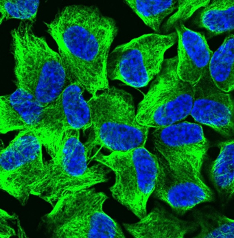
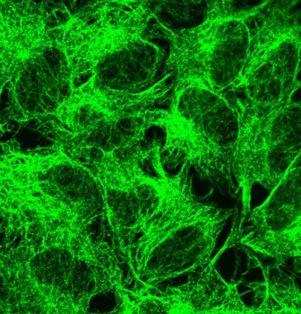
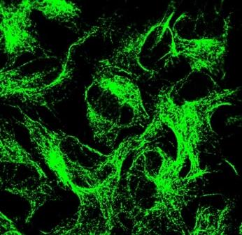

# Analysis of Corneal Images using Image processing

> **Current project scope:** the model in this repository classifies fluorescence microscopy images of cells into **control**, **stress**, and **recovery** classes. The current data and labels are not corneal-image annotations, and this experimental model is not a clinical or diagnostic tool.

This project explores whether a convolutional neural network can distinguish cell states from fluorescence microscopy images. The images show the microtubule network in green and cell nuclei stained with DAPI in blue. Since only about 120 original images were available, the workflow combines biologically conservative augmentation with transfer learning from an ImageNet-pretrained ResNet18.

The goal is to demonstrate a small, end-to-end image-classification workflow: prepare a dataset, train and evaluate a model on held-out real images, and try individual images through a browser demo.

## Example images

The following project images illustrate the three labels used by the classifier:

| Control | Stress | Recovery |
|:---:|:---:|:---:|
|  |  |  |
| **Control** — reference cell condition | **Stress** — stress-condition example | **Recovery** — recovery-condition example |

These examples illustrate the class labels; they are not a substitute for reviewing the complete dataset or the model's test results.

## What the project does

Given an image, the model produces a score for each of the three classes. The predicted class is the one with the largest softmax score. The demo displays that class and its score as a confidence percentage.

```text
Fluorescence image
       ↓
Resize and normalize
       ↓
ResNet18 inference
       ↓
Softmax scores for control / recovery / stress
       ↓
Highest-scoring class and confidence
```

This is a **three-way image classifier**, not an object detector or a segmentation model. It assigns one label to the complete input image.

## Dataset and preparation

The reported starting dataset contains approximately 120 original images:

| Class | Reported original images |
|---|---:|
| Control | 74 |
| Stress | 27 |
| Recovery | 20 |
| **Total** | **121** |

The classes are imbalanced, with substantially more control images than stress or recovery images. The dataset workflow addresses this by splitting the originals first and augmenting the training data afterward. Splitting before augmentation helps prevent near-identical variants of an original image from appearing in both training and validation/test sets.

The reported split uses stratification, a fixed random seed of 42, and a 70% / 15% / 15% train/validation/test target. The split counts supplied for the project are:

| Class | Train originals | Validation originals | Test originals |
|---|---:|---:|---:|
| Control | 51 | 11 | 12 |
| Stress | 18 | 4 | 5 |
| Recovery | 12 | 3 | 3 |
| **Total** | **81** | **18** | **20** |

**Count to verify:** these split counts account for 119 images, while the reported class totals add up to 121. Confirm which two images were excluded (or correct the per-class totals) before using these counts as a definitive dataset record.

Class-prefixed filenames help avoid collisions when different source folders contain images with the same original filename. A content-duplicate check was also reported before splitting; no identical files across classes were found.

### Training-only augmentation

Augmentation is applied to training data only. The reported offline augmentation targets roughly 2,000 training images per class:

| Class | Training originals | Augmented copies per original | Approx. augmented copies |
|---|---:|---:|---:|
| Control | 51 | 40 | 2,040 |
| Stress | 18 | 114 | 2,052 |
| Recovery | 12 | 171 | 2,052 |
| **Total** | **81** | — | **6,144** |

The original training images are additional to these augmented copies, giving about 6,225 training files in total. These variants are correlated images, not new independent biological samples; this is especially important for recovery, where many variants descend from only 12 reported training originals.

The augmentations are intended to preserve the biological meaning of the fluorescence channels:

- Rotations up to 180 degrees and horizontal/vertical flips.
- Small scale and translation changes.
- Mild brightness/contrast variation and Gaussian noise.
- Mild Gaussian blur in the offline augmentation script.

Hue shifts, channel swaps, aggressive deformations, and strong intensity changes are avoided. The green tubulin and blue DAPI signals have distinct meanings, and their spatial relationship should be preserved. Augmentations are applied jointly to the image channels.

An augmentation sanity-check script is included to visually inspect transformed examples. Validation and test images remain real, unaugmented images.

## Model and training

The classifier uses **transfer learning** rather than training a deep network from scratch:

| Setting | Value |
|---|---|
| Backbone | ResNet18, initialized with ImageNet pretrained weights |
| Output layer | Replaced with a fully connected layer for 3 classes |
| Input size | 224 × 224 pixels |
| Loss | Cross-entropy with label smoothing of 0.1 |
| Optimizer | AdamW, learning rate 0.0001, weight decay 0.0001 |
| Learning-rate schedule | Cosine annealing over 30 epochs |
| Batch size | 32 |
| Model selection | Keep the checkpoint with the best validation accuracy |
| Checkpoint file | `best_model.pt` |

The training transform also applies random rotations, flips, small affine changes, mild brightness/contrast changes, and Gaussian noise on the fly. The evaluation transform resizes to 224 × 224 and applies ImageNet normalization (mean `(0.485, 0.456, 0.406)`, standard deviation `(0.229, 0.224, 0.225)`) without random augmentation.

`torchvision.datasets.ImageFolder` sorts class-directory names alphabetically. The output indices are therefore:

| Model output index | Class |
|---:|---|
| 0 | `control` |
| 1 | `recovery` |
| 2 | `stress` |

This alphabetical order differs from the order in `config.py`. Evaluation and the browser demo should use the model's alphabetical index order when translating an output index into a class name.

## Reported test results

The reported final evaluation uses **20 real test images** that were not augmented or used for training:

| Class | Precision | Recall | F1-score | Test images |
|---|---:|---:|---:|---:|
| Control | 1.00 | 0.83 | 0.91 | 12 |
| Recovery | 0.50 | 0.67 | 0.57 | 3 |
| Stress | 0.83 | 1.00 | 0.91 | 5 |
| **Overall accuracy** | — | — | — | **0.85 (17/20)** |

Confusion matrix (rows are the true class; columns are the predicted class):

| True class ↓ / Predicted → | Control | Recovery | Stress |
|---|---:|---:|---:|
| Control | 10 | 2 | 0 |
| Recovery | 0 | 2 | 1 |
| Stress | 0 | 0 | 5 |

Examples from the reported single-image predictions:

| Image | True class | Predicted class | Confidence | Outcome |
|---|---|---|---:|---|
| `control_Picture10.png` | Control | Recovery | 80.9% | Incorrect |
| `recovery_Picture13.png` | Recovery | Recovery | 59.8% | Correct |
| `stress_Picture15.png` | Stress | Stress | 92.2% | Correct |

The reported results show perfect recall for stress on this small test set. The main errors involve control and recovery, which can be visually similar as cells recover their microtubule networks. Recovery has only three test examples, so its metrics are particularly uncertain. A high confidence score is not proof that a prediction is correct; the reported high-confidence control-to-recovery error is a reason to inspect borderline examples.

These numbers describe one small held-out split, not a guarantee of performance on new labs, microscopes, staining protocols, or patient samples. The test set is small, and the large number of augmented files does not increase the number of independent source images.

## Try the browser demo

The browser interface lets you select an image, preview it, and request a prediction without refreshing the page. It sends the image as `multipart/form-data` to `POST /predict`. The local server loads `best_model.pt`, preprocesses the image using the evaluation transform, runs inference, and returns a class and confidence value.

From the project directory, start the server:

```bash
.venv/bin/python app.py
```

Then open [http://127.0.0.1:8000](http://127.0.0.1:8000). Do not open `index.html` directly as a `file://` URL: predictions require the local server to be running.

The API response is:

```json
{
  "class": "stress",
  "confidence": 0.924
}
```

The demo displays `0.924` as `92.4%`. Its API endpoint, multipart field name, and accepted class names are grouped at the top of `script.js`. The server expects the uploaded file under the `image` field.

## Running the project scripts

The main scripts are:

| File | Purpose |
|---|---|
| `config.py` | Shared data path, class labels, random seed, and image size |
| `main.py` | Splits source images into train, validation, and test folders |
| `balance.py` | Writes class-balanced augmented training copies |
| `san.py` | Displays augmented examples for a visual sanity check |
| `train.py` | Trains ResNet18 and saves the best validation checkpoint |
| `test.py` | Evaluates the test split and demonstrates single-image prediction |
| `app.py` | Serves the browser demo and handles `POST /predict` |
| `index.html`, `style.css`, `script.js` | Browser interface |

Before running the data-preparation scripts, make sure the source and destination paths in `main.py` and `config.py` point to the intended dataset folders. The current project configuration uses a WSL-mounted Windows data path. A typical workflow is:

```bash
.venv/bin/python main.py
.venv/bin/python balance.py
.venv/bin/python san.py
.venv/bin/python train.py
.venv/bin/python test.py
```

Training and evaluation require the prepared dataset at the configured path. The browser demo requires `best_model.pt`. `app.py` uses the project environment's PyTorch, torchvision, Albumentations, NumPy, and Pillow dependencies.

## Limitations and next steps

- Add more **independent original images**, particularly in the recovery class, rather than relying on additional augmented copies.
- Reconcile the reported original-image counts with the split counts.
- Validate on a larger, independent test set and, where possible, images from different acquisition conditions.
- Review control/recovery errors with domain expertise and confirm labels for ambiguous images.
- Treat the displayed softmax score as model confidence, not calibrated probability or a clinical conclusion.
- Update the project title or dataset if the intended scope is specifically corneal-image analysis; the current model and examples concern cell-state fluorescence microscopy.
